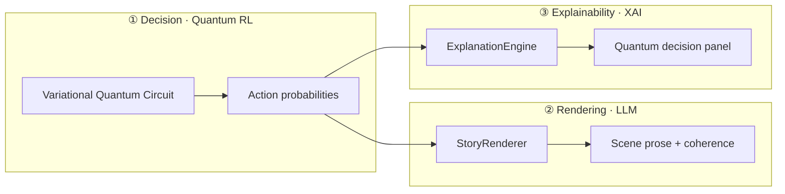
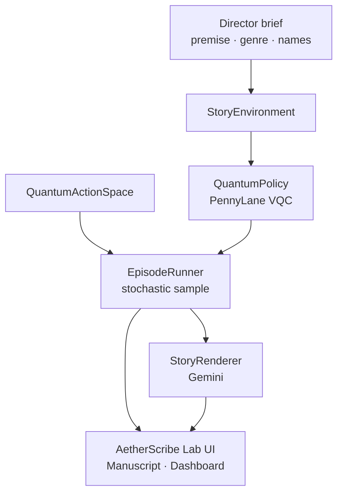
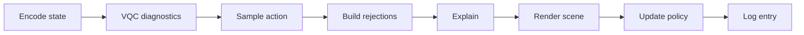

<div align="center">

# AetherScribe Lab

**Quantum Narrative Intelligence** · Master Render Edition

[](https://www.python.org/)
[](https://pennylane.ai/)
[](https://streamlit.io/)
[](https://ai.google.dev/)

*Explainable multi-agent stories — quantum decisions first, prose second.*

[Quick Start](#quick-start) · [Features](#features) · [Architecture](#architecture) · [Explainability](#quantum-explainability) · [Docs](#documentation)

<br>

</div>

---

## Overview

**AetherScribe Lab** is a research platform for **explainable, multi-agent narrative generation**. A **Variational Quantum Circuit (VQC)** resolves *what happens* in each scene **before** any text is written. An LLM then renders locked actions into publication-style prose, while the UI surfaces a full audit trail: measured paths, alternate branches, posteriors, trait influence, and counterfactual rationale.

| | |
|:---:|:---|
| **Repository** | `quantum_rl` — Streamlit app, quantum policy, environment, LLM renderer, research dashboard |
| **Launch** | `streamlit run app.py` |
| **Remote** | [github.com/MUKILAN0608/AetherScribe](https://github.com/MUKILAN0608/AetherScribe) |

### How it differs from a plain LLM storyteller

```
  Typical LLM          →    free-form plot  →    opaque choices
  AetherScribe Lab     →    VQC measures    →    locked actions  →    explained prose
```

<br>

## Features

<table>
<tr>
<td width="50%" valign="top">

### Quantum policy
- 4-qubit narrative state encoding  
- Character trait biasing on the VQC  
- Joint action space (protagonist + antagonist + ally)  
- Stochastic measurement with honest posterior labels  

</td>
<td width="50%" valign="top">

### Narrative engine
- Gemini scene rendering (5–8 sentences per scene)  
- Premise-locked coherence scoring  
- Name detection from your director brief  
- Markdown · LaTeX · plain-text exports  

</td>
</tr>
<tr>
<td width="50%" valign="top">

### Explainability
- Per-scene **Quantum decision** cards  
- Chosen path · alternates · why-not analysis  
- Character influence bars  
- Sampling notes when peak ≠ selected  

</td>
<td width="50%" valign="top">

### Research dashboard
- Tension, coherence, utility, entropy, risk  
- Attribution, bonds, control heatmap  
- Trajectory embedding (PCA)  
- Audit log → `logs/research_audit.log`  

</td>
</tr>
</table>

<br>

## Quick start

### 1 · Install

```bash
git clone https://github.com/MUKILAN0608/AetherScribe.git
cd AetherScribe    # local folder may be quantum_rl
pip install -r requirements.txt
```

### 2 · Configure

Create `.env` in the project root:

```env
GOOGLE_API_KEY=your_gemini_api_key_here
```

> Without a valid key, scene quality and entity detection are limited. The sidebar shows whether the narrative engine is connected.

### 3 · Run

```bash
streamlit run app.py
```

| Step | Action |
|:----:|--------|
| 1 | Enter a **premise** with character names |
| 2 | Click **Detect names from premise** (optional) |
| 3 | Choose genre, language, and scene count (6–12) |
| 4 | Click **Generate** — review **Manuscript** and **Dashboard** |

<br>

## Architecture

### Triad of authority

AetherScribe separates responsibilities so no single layer can silently override the others.



| Authority | Components | Rule |
|-----------|------------|------|
| **Decision** | `QuantumPolicy`, `QuantumActionSpace`, `EpisodeRunner` | Plot branch chosen **before** text generation |
| **Rendering** | `StoryRenderer` | Prose must follow locked joint actions |
| **Explainability** | `ExplanationEngine`, `ui/decisions.py`, `ui/quantum_panel.py` | Every measure has rationale + counterfactuals |

### System flow



### State encoding (4 qubits)

| Feature | Role |
|---------|------|
| **Tension** | Dramatic intensity ∈ [0, 1] |
| **Phase** | Arc position — intro / rising / climax |
| **Progress** | `step / max_steps` |
| **Genre** | Thriller, horror, drama, fantasy, … |

**Reward:** `composite_reward = env_reward × coherence_score`

<br>

## Quantum explainability

Open **Manuscript → Scenes & quantum trace** and expand any scene.

<div align="center">

| Selected P | Peak P | Entropy | Coherence |
|:----------:|:------:|:-------:|:---------:|
| Branch used in the story | Highest in superposition | Spread of distribution | Prose ↔ action fit |

</div>

### Panel at a glance

| Section | What you see |
|---------|----------------|
| **Legend** | How to read posteriors (high alternate % ≠ bug) |
| **Metrics** | Selected P · Peak P · entropy · risk · margin ΔP · coherence |
| **Sampling note** | When measured branch &lt; VQC peak — stochastic draw explained |
| **Chosen path** | Measured joint action per character name |
| **Policy rationale** | Tension, traits, disposition, narrative phase |
| **Character influence** | Normalized influence bars |
| **Alternates** | Top paths not chosen + full why-not paragraphs |
| **Narrative trace** | One-sentence summary of the measured path |

<details>
<summary><strong>Metric definitions</strong></summary>

<br>

| Metric | Meaning |
|--------|---------|
| **Selected branch P** | Posterior of the **sampled** joint action used in the scene |
| **Peak branch P** | Maximum posterior over **all** joint actions |
| **Entropy** | Shannon entropy of the action distribution |
| **Risk** | Policy risk diagnostic from the VQC step |
| **Margin ΔP** | Gap between 1st and 2nd largest posterior |
| **Coherence** | LLM score for prose ↔ measured action alignment |

</details>

<details>
<summary><strong>Why selected P can be lower than an alternate (FAQ)</strong></summary>

<br>

**Question:** *Chosen path shows 13% but an alternate shows 49% — is the data wrong?*

**Answer:** No. That is **correct AetherScribe behavior.**

```python
# evaluation/episode_runner.py
action_idx = int(np.random.choice(len(probs), p=probs))
```

The VQC outputs a full distribution; the story **samples** one joint action. The **peak** branch is the mode; the **measured** branch is the draw used for rendering. The UI shows **Selected branch P** vs **Peak branch P** plus a sampling note when they diverge.

For deterministic (always argmax) experiments, use `int(np.argmax(probs))` in `episode_runner.py` and note that in any publication.

</details>

<br>

## AetherScribe Lab UI

### Sidebar — director brief

| Control | Purpose |
|---------|---------|
| **Premise** | Story setup with character names |
| **Detect names** | Gemini extraction or heuristics |
| **Characters** | Protagonist · antagonist · ally display names |
| **Genre / language / scenes** | 6–12 scenes per episode |
| **Generate** | Full run at `render_depth="full"` |

### Tabs

| Tab | Contents |
|-----|----------|
| **Manuscript** | KPI strip · full story · per-scene prose + quantum trace |
| **Dashboard** | Plotly telemetry with your character names on every chart |

### Manuscript exports

| Function | Output |
|----------|--------|
| `compile_full_manuscript()` | Continuous story text |
| `compile_plain_text_export()` | Plain-text archive |
| `generate_manuscript_markdown()` | Structured Markdown |
| `generate_manuscript_latex()` | LaTeX for papers |

<br>

## Dashboard telemetry

| Theme | Charts |
|-------|--------|
| **Narrative dynamics** | Tension · coherence · utility · decision margin ΔP |
| **Quantum diagnostics** | Posterior per scene · entropy · risk |
| **Characters** | Trait pulse · attribution pie · trust / enmity bonds |
| **Structure** | Control heatmap · trajectory embedding (PCA) |

<br>

## Episode pipeline



Each scene log includes: `probs`, `action_idx`, `attribution`, `rejections`, `rationale`, `story`, `coherence`, `weights`, and more.

<br>

<details>
<summary><strong>Configuration & environment variables</strong></summary>

<br>

| Variable | Purpose |
|----------|---------|
| `GOOGLE_API_KEY` | Gemini — scenes, coherence, rejections, names |
| `LOG_LEVEL` | Logging verbosity |
| `DATABASE_URL` | Default `sqlite:///./aetherscribe_lab.db` |

**Render depth** (`evaluation/episode_runner.py`):

| Mode | Behavior |
|------|----------|
| `full` | Scene + coherence + rejection LLM *(app default)* |
| `standard` | Scene + coherence; template rejections |
| `fast` | Scene only; heuristic coherence |

**Hyperparameters** (`app.py`): `lr=0.01` · `eps=0.01` · `temperature=0.88`

> Never commit `.env` to Git. Rotate keys if exposed.

</details>

<details>
<summary><strong>Project structure</strong></summary>

<br>

```
quantum_rl/
├── app.py                    # Streamlit entry
├── quantum_policy/           # VQC · action space
├── environment/              # Story physics · state encoding
├── agents/                   # Trait matrices
├── llm/                      # Renderer · prompts · entity extraction
├── explainability/           # Rationale engine
├── evaluation/               # Episode runner · database
├── ui/                       # Manuscript · dashboard · quantum panel
├── experiments/              # CLI runner
└── tests/                    # verify_system.py
```

See also `TECHNICAL_SPEC.md` and `DETAILED_SYSTEM_FUNCTIONALITY.txt`.

</details>

<details>
<summary><strong>Troubleshooting</strong></summary>

<br>

| Symptom | Fix |
|---------|-----|
| Empty / short scenes | Set `GOOGLE_API_KEY`; check sidebar connection |
| Selected P &lt; alternate P | Expected — see [FAQ above](#quantum-explainability) |
| Truncated why-not text | Regenerate — old Streamlit session data |
| Empty charts | Complete a full episode first |
| Wrong names | **Detect names from premise** → **Generate** again |

</details>

<br>

## Development

```bash
python tests/verify_system.py
python experiments/run_single_episode.py
```

Audit trail: `logs/research_audit.log` · logger `AetherScribeLab`

<br>

## Documentation

| Resource | Description |
|----------|-------------|
| [TECHNICAL_SPEC.md](TECHNICAL_SPEC.md) | Architecture specification |
| [DETAILED_SYSTEM_FUNCTIONALITY.txt](DETAILED_SYSTEM_FUNCTIONALITY.txt) | Full v6.0 academic reference |

### Citation

```bibtex
@software{aetherscribe2026,
  author = {Mukilan},
  title = {AetherScribe Lab: Quantum Narrative Intelligence System},
  year = {2026},
  version = {6.0},
  url = {https://github.com/MUKILAN0608/AetherScribe}
}
```

> We generated narratives using AetherScribe Lab (v6.0), a quantum reinforcement learning framework that resolves joint character actions via a variational quantum circuit before LLM rendering, with per-scene explainability over posteriors and counterfactual branches.

<br>

---

<div align="center">

**AetherScribe Research** · Master Render Edition v6.0

*Quantum Narrative Intelligence*

<br>

[](https://github.com/MUKILAN0608/AetherScribe)

</div>
